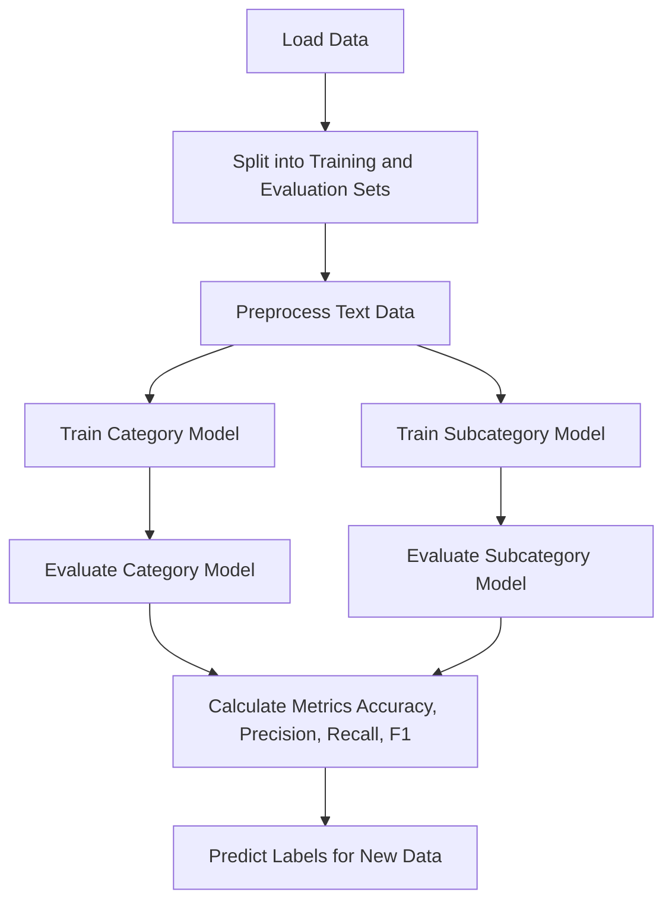

# **CDAC-CyberSort: Few-Shot Text Classification Using Transformers**

This repository demonstrates training and evaluating separate models for **category** and **subcategory** classification using the Hugging Face Transformers library. The workflow involves preprocessing data, training models, and evaluating them for accuracy, precision, recall, and F1 scores.

## **Workflow Overview**

The project is structured to:
1. Load datasets (`category.csv` and `subcategory.csv`).
2. Preprocess data for tokenization.
3. Train separate models for category and subcategory classification.
4. Evaluate the trained models using metrics.
5. Predict category and subcategory labels for unseen data.

### ** Flowchart of few shots training**



---

## **Prerequisites**

Ensure you have the following installed:
- Python 3.8+
- Transformers (`pip install transformers`)
- Datasets (`pip install datasets`)
- scikit-learn (`pip install scikit-learn`)
- Pandas (`pip install pandas`)

---

## **Data Format**

### **Input Files**
1. **`category.csv`**
2. **`subcategory.csv`**

Each file should have the following headers:
- `text`: The text data to classify.
- `label`: The corresponding label for the text.

Example:

| text                            | label            |
|---------------------------------|------------------|
| "My credit card was hacked."   | "Financial Fraud" |
| "Unauthorized access detected." | "Other Cyber Crime" |

---

## **Key Scripts**

### 1. **Preprocessing**
- Tokenizes the text data using a tokenizer (e.g., `distilbert-base-uncased`).
- Splits data into training and evaluation sets (80/20 split).
  
### 2. **Training**
- Trains separate models for `category` and `subcategory` classification.
- Uses Hugging Face's `Trainer` API with metrics like accuracy, precision, recall, and F1 score.

### 3. **Evaluation**
- Computes metrics for evaluation datasets.
- Predicts labels for unseen data.

---

## **Usage**

### 1. **Clone the Repository**
```bash
git clone https://github.com/dvkcool/CDAC-CyberSort.git
cd CDAC-CyberSort/FewshotsTraining

```

### 2. **Prepare Data**
Place `category.csv` and `subcategory.csv` in the root directory.

### 3. **Run the Script**
```bash
python trainer.py
```

---

## **Output**

### **Training Metrics**
- Accuracy
- Precision
- Recall
- F1 Score

### **Evaluation Metrics**
Printed metrics for both category and subcategory models:
```plaintext
Category Metrics:
{'accuracy': 0.92, 'precision': 0.91, 'recall': 0.92, 'f1': 0.91}

Subcategory Metrics:
{'accuracy': 0.85, 'precision': 0.84, 'recall': 0.85, 'f1': 0.84}
```

---

## **Directory Structure**

```plaintext
.
├── category.csv          # Input data for category classification
├── subcategory.csv       # Input data for subcategory classification
├── train_and_evaluate.py # Main script for training and evaluation
├── README.md             # Documentation
```

---

## **Future Enhancements**

1. Fine-tune models on larger datasets for better accuracy.
2. Implement hyperparameter tuning for optimal performance.
3. Add visualization for evaluation metrics (e.g., confusion matrix).

---

## **Contributors**
- **Divyanshu Kumar** - [dvkcool](https://github.com/dvkcool)
- **Shingamba Pukhramba** - [shingamba](https://github.com/shingamba)

Feel free to open an issue for suggestions or improvements.

--- 
          