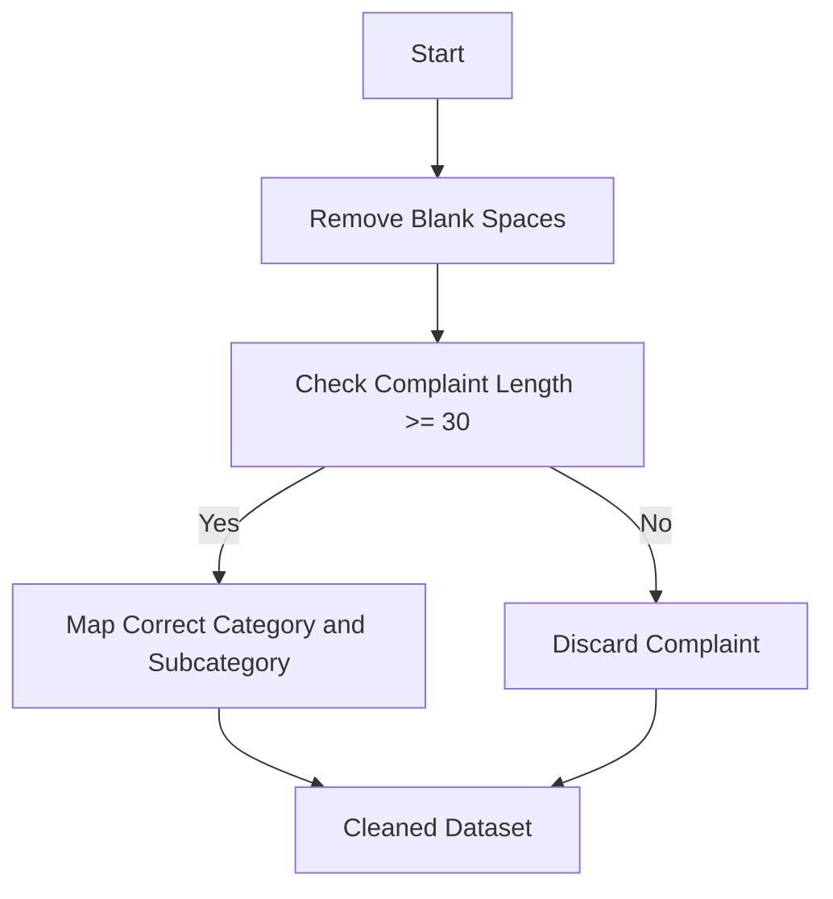
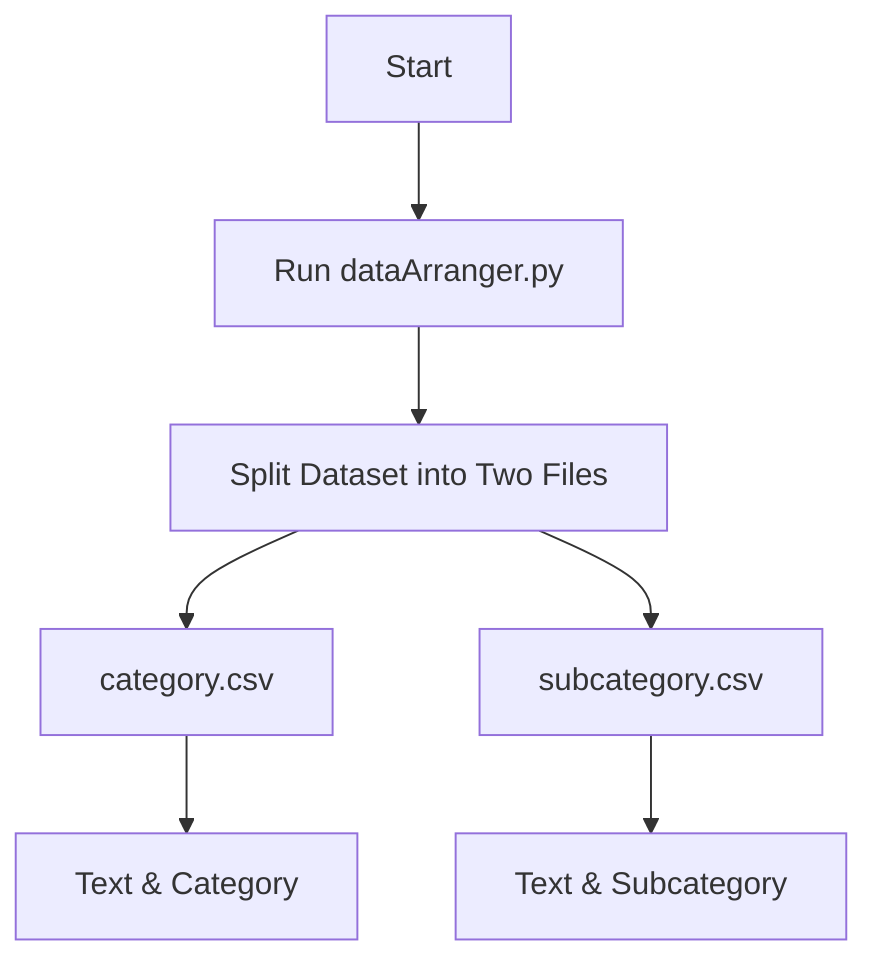
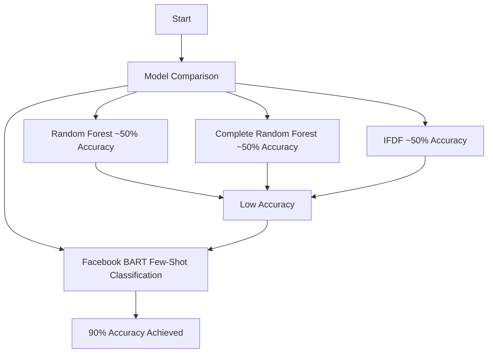
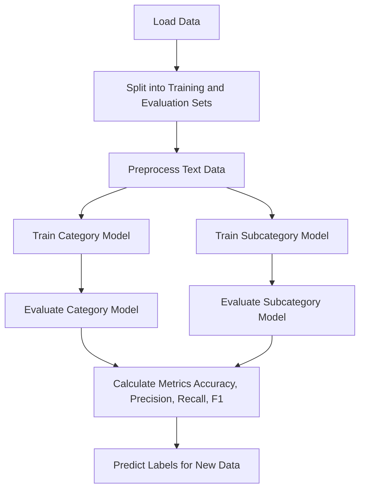

# **CDAC-CyberSort: Few-Shot Text Classification Using Transformers**
This project focuses on developing a machine learning pipeline to categorize cyber complaints into predefined categories and subcategories. It begins with cleaning the dataset by removing blank spaces, filtering out complaints shorter than 30 characters, and mapping complaints to their correct categories and subcategories. After cleaning, the data is preprocessed into two CSV files—category.csv and subcategory.csv—for easy training.

Traditional models like Random Forest, Complete Random Forest, and Improved Feature Decision Forest (IFDF) were tested but achieved only about 50% accuracy. To overcome this, we used **Few-Shot Classification with Facebook’s BART** (Bidirectional and Auto-Regressive Transformer). **BART** excels at handling complex sentence structures, incomplete text, and mixed-language input, like Hinglish. By fine-tuning BART with minimal labeled data, we achieved a significant accuracy improvement, **reaching 90% accuracy** in complaint categorization. This demonstrates the effectiveness of transformer models for real-world classification tasks, particularly when data is limited.

## Steps Involved

### 1. Data Cleaning
We cleaned the provided dataset using scripts from the `data_cleaning` folder to ensure consistency and quality.  
The cleaning process involves:
1. Removing blank spaces from the text.
2. Ensuring the complaint length (after space removal) is at least **30 characters**.
3. Mapping complaints to the correct **category** and **subcategory** using the provided mapping flow.



---

### 2. Data Preprocessing
We used the `dataArranger.py` script to create two separate datasets for further analysis:
- **`category.csv`**: Contains the complaint text and its corresponding category.
- **`subcategory.csv`**: Contains the complaint text and its corresponding subcategory.



---

### 3. ML Model Selection
Several models were evaluated for categorization tasks:
1. **Random Forest**  
2. **Complete Random Forest**  
3. **IFDF (Improved Feature Decision Forest)**  

Each of these models achieved approximately **50% accuracy**.  Detailed report can be found in the Reports folder.
A **few-shot classification** approach using **Facebook's BART** model yielded a much better accuracy of **90%**.



---

## Folder Structure
```
├── Data Cleaning
│   ├── cleaning.py
│   ├── mapping.py
│   ├── merge.py
│   ├── split.py
│   └── unique.py
├── FewshotsTraining
│   ├── category.csv
│   ├── dataArranger.py
│   ├── results
│   ├── subcategory.csv
│   └── trainer.py
├── GGUF_Model
│   ├── buildfile.sh
│   ├── chat.py
│   ├── Dockerfile
│   └── model
├── LICENSE
├── ModelFiles
│   ├── a.modelfile
│   ├── b.modelfile
│   └── original.modelfile
├── PythonTester
│   ├── bert-category-classifier
│   ├── bertClassifier.ipynb
│   ├── bertii.py
│   ├── bert.py
│   ├── categorized_complaints.csv
│   ├── categorized_complaintsiii.csv
│   ├── category_model.pkl
│   ├── cleaned_dataset.csv
│   ├── cyber_complaint_classifier.pkl
│   ├── ifidf.py
│   ├── ollamaiii.py
│   ├── ollamaii.py
│   ├── ollama.py
│   ├── outputs.csv
│   ├── output.txt
│   ├── prompt.txt
│   ├── randomforest.py
│   ├── requirements.txt
│   ├── subcategory_model.pkl
│   ├── test_data_cl.csv
│   ├── test_data.csv
│   ├── test_data_up.csv
│   ├── tester.py
│   ├── tfidf_vectorizer.pkl
│   └── venv
├── README.md
└── Reports
    ├── Bert.md
    ├── completeRandomForest.md
    └── randomForest.md
```

--- 


## **ML Training Workflow Overview**

The project is structured to:
1. Load datasets (`category.csv` and `subcategory.csv`).
2. Preprocess data for tokenization.
3. Train separate models for category and subcategory classification.
4. Evaluate the trained models using metrics.
5. Predict category and subcategory labels for unseen data.

### **Flowchart of few shots training**



---

## **Prerequisites**

Ensure you have the following installed:
- Python 3.8+
- Transformers (`pip install transformers`)
- Datasets (`pip install datasets`)
- scikit-learn (`pip install scikit-learn`)
- Pandas (`pip install pandas`)

---

## **Data Format**

### **Input Files**
1. **`category.csv`**
2. **`subcategory.csv`**

Each file should have the following headers:
- `text`: The text data to classify.
- `label`: The corresponding label for the text.

Example:

| text                            | label            |
|---------------------------------|------------------|
| "My credit card was hacked."   | "Financial Fraud" |
| "Unauthorized access detected." | "Other Cyber Crime" |

---

## **Key Scripts**

### 1. **Preprocessing**
- Tokenizes the text data using a tokenizer (e.g., `distilbert-base-uncased`).
- Splits data into training and evaluation sets (80/20 split).
  
### 2. **Training**
- Trains separate models for `category` and `subcategory` classification.
- Uses Hugging Face's `Trainer` API with metrics like accuracy, precision, recall, and F1 score.

### 3. **Evaluation**
- Computes metrics for evaluation datasets.
- Predicts labels for unseen data.

---

## **Usage**

### 1. **Clone the Repository**
```bash
git clone https://github.com/dvkcool/CDAC-CyberSort.git
cd CDAC-CyberSort/FewshotsTraining

```

### 2. **Prepare Data**
Place `category.csv` and `subcategory.csv` in the FewShotsTraining directory as per above instructions.

### 3. **Run the Script**
```bash
python trainer.py
```

---

## **Output**

### **Evaluation Metrics**
Printed metrics for both category and subcategory models:
```plaintext
Category Metrics:
{'accuracy': 0.92, 'precision': 0.91, 'recall': 0.92, 'f1': 0.91}

Subcategory Metrics:
{'accuracy': 0.85, 'precision': 0.84, 'recall': 0.85, 'f1': 0.84}
```


---

## **Future Enhancements**

1. Fine-tune models on larger datasets for better accuracy.
2. Implement hyperparameter tuning for optimal performance.
3. Add visualization for evaluation metrics (e.g., confusion matrix).

---

## **Contributors**
- **Mr. Y Ranjan Singh** : Scientist E, Joint Director, C-DAC CINE
- **Mr. Divyanshu Kumar** : Scientist B, C-DAC CINE [dvkcool](https://github.com/dvkcool)
- **Shingamba Pukhramba** : Project Associate, C-DAC CINE [shingamba](https://github.com/shingamba)


Feel free to open an issue for suggestions or improvements.

--- 
          